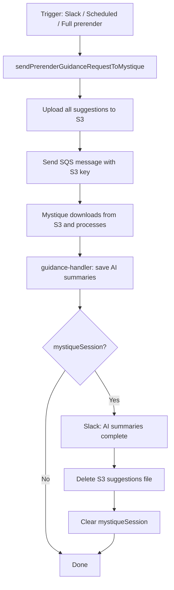

# S3-Based Mystique Suggestion Dispatch

| Field | Value |
|-------|-------|
| **Status** | Accepted |
| **Author** | Sahil Silare |
| **Created** | 2026-06-22 |
| **PR** | [#2709](https://github.com/adobe/spacecat-audit-worker/pull/2709) |

---

## Summary

Prerender suggestions are now uploaded to S3 and Mystique receives only the S3 key via SQS. This removes the 256 KB SQS message size limit that previously capped batches at 320 suggestions, eliminating the need for multi-batch chaining entirely.

---

## Problem Statement

SQS has a 256 KB message size limit. The previous implementation sent suggestions inline in the SQS message, limiting batches to 320 suggestions. Sites with more suggestions required complex sequential batch chaining, adding state management overhead and failure modes.

---

## Goals

1. All eligible suggestions reach Mystique in a single dispatch, regardless of count
2. No artificial batch size limit imposed by SQS message size constraints
3. Slack notifications report completion when triggered from Slack
4. S3 suggestions file is cleaned up after Mystique completes
5. Simpler architecture with no batch chaining or session cursors

---

## Technical Design

### State Storage

- **S3** — all suggestions are stored at `prerender/mystique-suggestions/{opportunityId}.json`. Deleted after Mystique completes.
- **Opportunity data** — a `mystiqueSession` object is saved on the Opportunity's data field (only when Slack context is present) with:
  - `slackChannelId`, `slackThreadTs` — Slack thread context for completion notification
  - `suggestionsS3Key` — S3 key for cleanup

### Flow



### SQS Message Format

The SQS message to Mystique now contains S3 coordinates instead of inline suggestions:

```json
{
  "type": "guidance:prerender",
  "url": "https://example.com",
  "siteId": "...",
  "auditId": "...",
  "deliveryType": "aem_edge",
  "time": "2026-06-22T...",
  "data": {
    "opportunityId": "...",
    "suggestionsS3Key": "prerender/mystique-suggestions/{opportunityId}.json",
    "suggestionsS3Bucket": "spacecat-scraper-bucket",
    "generatePrompts": false,
    "siteRegion": ""
  }
}
```

### Error Handling

- **Cleanup errors are isolated** — `completeMystiqueRun` runs in its own try/catch inside guidance-handler. If S3 delete or `opportunity.save()` fails during cleanup, the current run's saved suggestions are not invalidated (returns `ok()`, not `badRequest()`).
- **S3 delete failures are non-fatal** — logged as a warning; the suggestions file may linger but does not affect correctness.
- **Non-Slack triggers** — `postMessageOptional` no-ops when `slackChannelId` or `slackThreadTs` is null. Only log lines are emitted.

### Trigger Compatibility

`sendPrerenderGuidanceRequestToMystique` is the single function used by all entry points:
- **ai-only mode** — `handleAiOnlyMode()` in step 1
- **Full prerender** — `processContentAndGenerateOpportunities()` in step 3

The S3 upload logic is trigger-agnostic.

---

## Alternatives Considered

| Alternative | Why rejected |
|-------------|-------------|
| **Send suggestions inline in SQS** | SQS has a 256 KB limit, capping batches at ~320 suggestions |
| **Multi-batch sequential chaining** | Complex state management (cursors, S3 manifests, session tracking) for a problem solved by S3 indirection |
| **Store session in a separate DB table** | Over-engineered; Opportunity data field is sufficient and auto-cleaned |

---

## Success Criteria

- [x] Sites with any number of suggestions receive AI summaries for all suggestions
- [x] No artificial batch size limit from SQS message size constraints
- [x] Slack notifications on completion when triggered from Slack
- [x] S3 suggestions file cleaned up after Mystique completes
- [x] Simpler codebase with no multi-batch chaining
- [x] 100% test coverage on changed files
