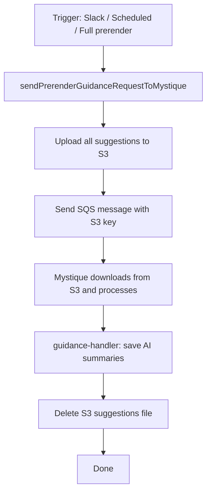

# S3-Based Mystique Suggestion Dispatch

| Field | Value |
|-------|-------|
| **Status** | Accepted |
| **Author** | Sahil Silare |
| **Created** | 2026-06-22 |
| **PR** | [#2709](https://github.com/adobe/spacecat-audit-worker/pull/2709), [#2713](https://github.com/adobe/spacecat-audit-worker/pull/2713) |

---

## Summary

Prerender suggestions are uploaded to S3 and Mystique receives only the S3 key via SQS. This removes the 256 KB SQS message size limit that previously capped batches at 320 suggestions. The S3 key is derived deterministically from the opportunityId (`prerender/mystique-suggestions/{opportunityId}.json`), so both producer and consumer can compute it independently.

---

## Problem Statement

SQS has a 256 KB message size limit. The previous implementation sent suggestions inline in the SQS message, limiting batches to 320 suggestions. Sites with more suggestions required complex sequential batch chaining, adding state management overhead and failure modes.

---

## Goals

1. All eligible suggestions reach Mystique in a single dispatch, regardless of count
2. No artificial batch size limit imposed by SQS message size constraints
3. S3 suggestions file is cleaned up after Mystique completes
4. Simpler architecture with no batch chaining or session cursors

---

## Technical Design

### State Storage

- **S3** — all suggestions are stored at `prerender/mystique-suggestions/{opportunityId}.json`. Deleted after Mystique completes via deterministic key derivation (no session state needed).

### Flow



### Mode-Based Suggestion Selection

When triggered from the Slack command with a mode, `handleAiOnlyMode` uses `mode-selector.js` to filter suggestions:

| Mode | Filter |
|------|--------|
| `ai-only` | Not OUTDATED, SKIPPED, FIXED, or edgeDeployed |
| `ai-only-current` | NEW, not coveredByDomainWide / edgeDeployed / coveredByPattern |
| `ai-only-missing` | NEW or FIXED, no aiSummary |

Candidates are built directly in `handleAiOnlyMode` and passed as `preBuiltCandidates` to bypass the downstream filter in `sendPrerenderGuidanceRequestToMystique`.

### SQS Message Format

The SQS message to Mystique contains S3 coordinates instead of inline suggestions:

```json
{
  "type": "guidance:prerender",
  "url": "https://example.com",
  "siteId": "...",
  "auditId": "...",
  "deliveryType": "aem_edge",
  "time": "2026-06-22T...",
  "data": {
    "opportunityId": "...",
    "suggestionsS3Key": "prerender/mystique-suggestions/{opportunityId}.json",
    "suggestionsS3Bucket": "spacecat-scraper-bucket",
    "generatePrompts": false,
    "siteRegion": ""
  }
}
```

### Error Handling

- **Dispatch failures propagate** — `sendPrerenderGuidanceRequestToMystique` throws on S3 upload or SQS send failure. Callers must catch: `handleAiOnlyMode` returns `status: 'failed'`; step-3 lets the audit framework handle the error.
- **Cleanup errors are isolated** — `cleanupSuggestionsFile` runs in its own try/catch inside guidance-handler. If S3 delete fails during cleanup, the saved suggestions are not invalidated (returns `ok()`, not `badRequest()`).
- **S3 delete failures are non-fatal** — logged as a warning; the suggestions file may linger but does not affect correctness.

### Trigger Compatibility

`sendPrerenderGuidanceRequestToMystique` is the single function used by all entry points:
- **ai-only modes** — `handleAiOnlyMode()` in step 1 (with preBuiltCandidates)
- **Full prerender** — `processContentAndGenerateOpportunities()` in step 3

The S3 upload logic is trigger-agnostic.

---

## Alternatives Considered

| Alternative | Why rejected |
|-------------|-------------|
| **Send suggestions inline in SQS** | SQS has a 256 KB limit, capping batches at ~320 suggestions |
| **Multi-batch sequential chaining** | Complex state management (cursors, S3 manifests, session tracking) for a problem solved by S3 indirection |
| **Store session in Opportunity data** | Couples transient Slack interaction to persistent data; deterministic S3 key derivation is simpler |

---

## Success Criteria

- [x] Sites with any number of suggestions receive AI summaries for all suggestions
- [x] No artificial batch size limit from SQS message size constraints
- [x] S3 suggestions file cleaned up after Mystique completes
- [x] Simpler codebase with no multi-batch chaining or session state
- [x] 100% test coverage on changed files
