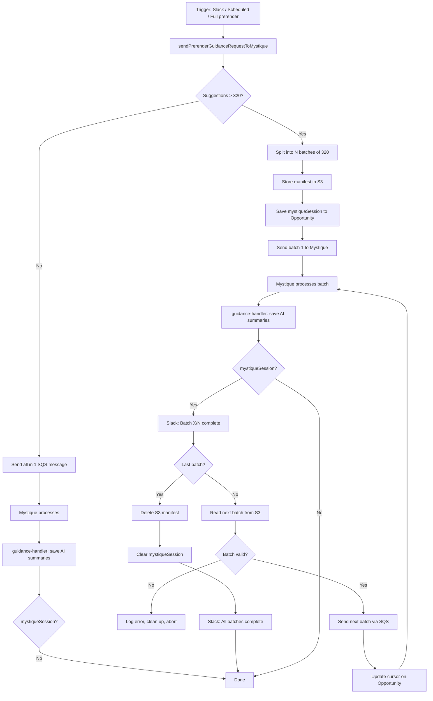

# Sequential Mystique Batch Processing

| Field | Value |
|-------|-------|
| **Status** | Accepted |
| **Author** | Shubham Silare |
| **Created** | 2026-06-22 |
| **PR** | [#2709](https://github.com/adobe/spacecat-audit-worker/pull/2709) |

---

## Summary

When prerender suggestions exceed the Mystique batch size limit (320), the system now sends batches sequentially — batch N+1 is only dispatched after Mystique confirms batch N is complete. Slack notifications report progress per batch and on completion.

---

## Problem Statement

Mystique cannot process multiple batches in parallel. The previous implementation only sent the first 320 suggestions and silently dropped the rest (marked with a `TODO` comment). Sites with more than 320 suggestions never received AI summaries for the overflow.

---

## Goals

1. All eligible suggestions reach Mystique, regardless of count
2. Batches are processed strictly sequentially (no parallel overload)
3. Slack notifications provide per-batch visibility when triggered from Slack
4. S3 and session state are cleaned up after the last batch completes
5. Single-batch runs (≤ 320 suggestions) remain unchanged — zero overhead

---

## Technical Design

### State Storage

- **S3** — the full batch manifest (array of arrays) is stored at `prerender/mystique-batches/{opportunityId}.json`. Deleted after the last batch completes.
- **Opportunity data** — a `mystiqueSession` object is saved on the Opportunity's data field with:
  - `totalBatches`, `currentBatchIndex` — cursor
  - `batchesS3Key` — S3 key for the manifest
  - `slackChannelId`, `slackThreadTs` — Slack thread context (nullable)
  - `generatePrompts`, `siteRegion` — forwarded to each chained SQS message

### Flow

### Error Handling

- **Chain errors are isolated** — `chainNextMystiqueBatch` runs in its own try/catch inside guidance-handler. If S3, SQS, or `opportunity.save()` fails during chaining, the current batch's saved suggestions are not invalidated (returns `ok()`, not `badRequest()`).
- **Corrupt manifest guard** — before sending the next batch, validates `Array.isArray(nextBatch) && nextBatch.length > 0`. If invalid, logs an error, cleans up S3 + session, and aborts.
- **Non-Slack triggers** — `postMessageOptional` no-ops when `slackChannelId` or `slackThreadTs` is null. Only log lines are emitted.

### Trigger Compatibility

`sendPrerenderGuidanceRequestToMystique` is the single function used by all entry points:
- **ai-only mode** — `handleAiOnlyMode()` in step 1
- **Full prerender** — `processContentAndGenerateOpportunities()` in step 3

The batching logic is trigger-agnostic.

---

## Alternatives Considered

| Alternative | Why rejected |
|-------------|-------------|
| **Send all batches in parallel** | Mystique cannot handle parallel processing — the original constraint |
| **Store session in a separate DB table** | Over-engineered; Opportunity data field is sufficient and auto-cleaned |
| **Store session entirely in S3** | Would require a separate S3 read on every guidance-handler invocation to check for session existence, even for single-batch runs |
| **Require Mystique to echo back batch metadata** | Would require Mystique-side changes; `opportunityId` already in response is sufficient to re-hydrate state from the DB |

---

## Success Criteria

- [ ] Sites with >320 suggestions receive AI summaries for all suggestions
- [ ] No parallel Mystique processing — strictly sequential
- [ ] Slack notifications per batch when triggered from Slack
- [ ] S3 batch file and `mystiqueSession` cleaned up after completion
- [ ] Single-batch runs have zero behavioral change
- [ ] 100% test coverage on changed files
