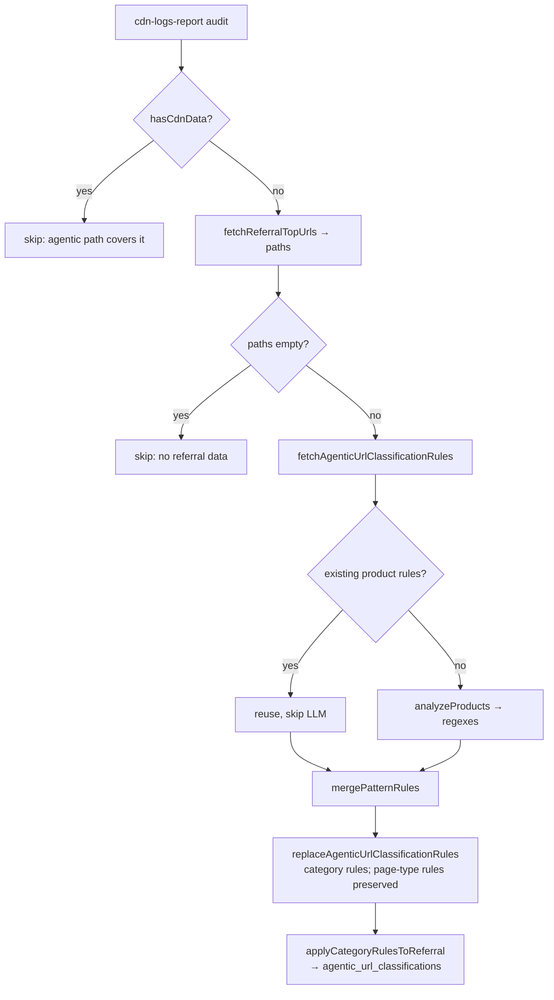

# Referral Category Generation for Sites Without CDN Logs

| Field | Value |
|-------|-------|
| **Status** | Proposed |
| **Author** | Omair Temurian |
| **Created** | 2026-07-15 |
| **Jira** | [LLMO-6257](https://jira.corp.adobe.com/browse/LLMO-6257) (epic LLMO-5440) |

---

## Summary

Extends the `cdn-logs-report` audit so sites whose referral data comes **only** from
non-CDN sources (optel / GA4 / Adobe Analytics / CJA — stored in the
`mysticat-data-service` Postgres, not Athena) still get URL **category** classifications.
It reuses the existing CDN category-generation machinery (`analyzeProducts` → merge →
`wrpc_replace_agentic_url_classification_rules`), but sources the URL corpus from Postgres
and materializes the rules onto referral URLs via a new data-service RPC. The
classification sink (`agentic_url_classifications`) is unchanged, so the shipped Referral
Traffic category read-filter (LLMO-6025/6/7) works with zero read-side changes.

---

## Problem Statement

The Referral Traffic category filter resolves category by joining referral rows to
`agentic_url_classifications`. That table is populated **only** by the `cdn-logs-report`
audit, whose entire URL corpus comes from Athena (CDN access logs). A site with referral
data only from non-CDN sources therefore has no corpus → `analyzeProducts` never runs →
no rules → no classifications → the category dropdown shows only "All".

---

## Goals

1. Referral-only sites (no CDN logs) get category rules generated and
   `agentic_url_classifications` rows materialized.
2. Reuse the existing category-generation logic; only the URL-corpus source changes.
3. No read-side changes — the shipped category filter just works once data exists.
4. Do not double-process CDN-covered sites (their agentic path already generates rules).
5. Best-effort and non-blocking: a failure never breaks the daily exports.

---

## Technical Design

### Data-service (mysticat-data-service, LLMO-6257 companion)

Two RPCs (migration `20260715150742_referral_category_apply_rpc.sql`):

- `rpc_referral_traffic_top_urls(p_site_id, p_since, p_limit)` — read RPC returning a
  site's top distinct referral `url_path`s ranked by summed pageviews across all referral
  sources. The Postgres analogue of the CDN Athena top-URLs query.
- `wrpc_apply_category_rules_to_referral(p_site_id, p_source, p_since, p_updated_by)` —
  write RPC that applies the site's active `agentic_url_category_rules` to its referral
  URLs and upserts `category_name` into `agentic_url_classifications`
  (`(site_id, host, url_path)`, preserving region/page_type/content_type).

### Audit-worker

New step in `runCdnLogsReport`, gated to no-CDN sites (`hasCdnData` is computed once and
shared with the agentic step). Flow:

New functions:
- `report-utils.js`: `fetchReferralTopUrls`, `applyCategoryRulesToReferral` (thin wrappers
  over the two RPCs via `context.dataAccess.services.postgrestClient`, siblings of the
  existing `replaceAgenticUrlClassificationRules`).
- `patterns-uploader.js`: `generateReferralPatternsWorkbook` — reuses `analyzeProducts` +
  the module's `mergePatternRules` + `replaceAgenticUrlClassificationRules`, then calls
  `applyCategoryRulesToReferral`. Only category rules are (re)generated; existing
  page-type rules are preserved.
- `handler.js`: `generateReferralPatterns` — best-effort wrapper (own try/catch), gated on
  `hasCdnData`.

### Decisions

- **Sink reuse** — writes to `agentic_url_classifications` (no new table), so reads are unchanged.
- **Reuse over regenerate** — existing product rules short-circuit the LLM, so re-runs
  don't churn customer-tuned categories or re-incur LLM cost.
- **Region-agnostic MVP** — classifications written with `region=''`; per-region is a follow-up.
- **`source='ai'`** — auto-derived rules carry the same customer-edit metadata as CDN-derived rules.

---

## Alternatives Considered

- **Loop `rpc_referral_traffic_by_url` per source and merge in JS** — rejected: that RPC is
  single-source and returns heavy paginated rows; merging across 4 sources is non-trivial
  new code. A dedicated `rpc_referral_traffic_top_urls` does the ranking/dedup server-side
  in one call.
- **New classification table for referral** — rejected: would require read-side changes;
  reusing `agentic_url_classifications` keeps the read filter untouched.

---

## Success Criteria

1. A referral-only site with configured referral data gets category rules generated and
   `agentic_url_classifications` rows materialized.
2. The existing Referral Traffic category dropdown populates for that site with no
   read-side changes.
3. CDN-covered sites are not double-processed.
4. A referral-generation failure is logged and never blocks the daily exports.
5. 100% test coverage on all new/changed source.

---

## Open Items / Follow-ups

- **Precedence** when a site later gains CDN traffic (human > CDN-derived > referral-derived).
- **Region fidelity** for multi-region sites (region-agnostic MVP may under-serve them).
- **LLM cost gating** if the no-CDN cohort grows large.
