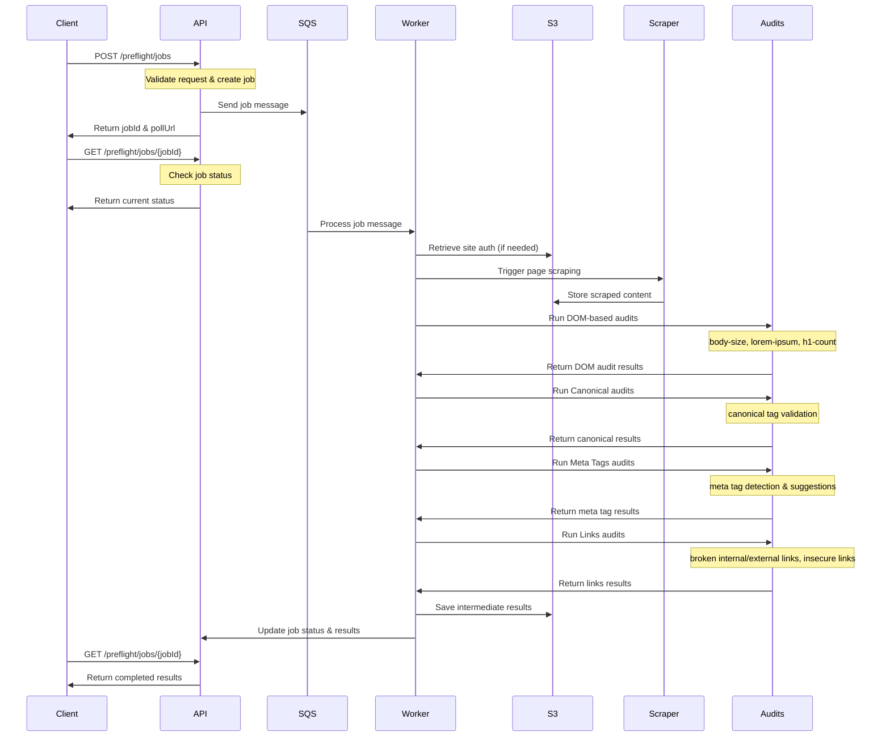

# Adobe Site Optimiser - Preflight Audits

## Overview

The Preflight functionality in Adobe Site Optimiser performs comprehensive SEO audits on preview or staging pages before they are published. This ensures that potential SEO issues are identified and addressed before the content goes live, helping to maintain optimal search engine performance.

### Business Context

The Preflight module was developed in response to direct customer feedback and market research. Multiple customer and partner conversations, including discussions with adobe.com, revealed that customers were frustrated by the fact that SEO improvement opportunities were only displayed after pages were published. This reactive approach limited the ability to prevent issues before they went live.

**Customer Pain Point:** Customers wanted to see optimization opportunities at authoring time, before publication, rather than discovering issues post-launch.

**Solution:** The Preflight module enables proactive detection of technical SEO issues during the content creation and review process, allowing teams to address problems before they impact live site performance.

### Value Proposition

The Preflight functionality significantly enhances Adobe Site Optimiser's value proposition by:

- **Preventing Issues Before Publication:** Catch SEO problems during the development/staging phase
- **Reducing Post-Launch Fixes:** Minimize the need for urgent fixes after pages go live
- **Improving Content Quality:** Ensure pages meet SEO best practices before publication
- **Streamlining Workflows:** Integrate SEO validation into existing content creation processes

### Supported Audit Categories

The Preflight module focuses on audit types that can be effectively performed on preview/staging content:

- **SEO Content Optimization:** Content length, placeholder text detection, heading structure
- **Technical SEO:** Canonical URLs, meta tags, link validation
- **Accessibility:** Basic accessibility checks that can be performed on preview content
- **Image Optimization:** Image-related SEO issues (when applicable)

This targeted approach ensures that the most impactful and actionable SEO improvements are identified before publication, while maintaining the system's performance and reliability.

## Audit Types

The preflight system performs several categories of audits:

### 1. DOM-Based Content Audits

These audits analyze the actual content and structure of the page using DOM parsing.

#### 1.1 Body Size Audit (`body-size`)
- **Purpose**: Ensures pages have sufficient meaningful content
- **Check**: Content length validation
- **Opportunity Trigger**: When page body content is 100 characters or less
- **SEO Impact**: Moderate
- **Recommendation**: Add more meaningful content to the page

#### 1.2 Lorem Ipsum Detection (`lorem-ipsum`)
- **Purpose**: Identifies placeholder text that should be replaced with actual content
- **Check**: Detects "Lorem ipsum" placeholder text in page content
- **Opportunity Trigger**: When Lorem ipsum text is found in the page body
- **SEO Impact**: High
- **Recommendation**: Replace placeholder text with meaningful content

#### 1.3 H1 Count Audit (`h1-count`)
- **Purpose**: Ensures proper heading structure for SEO
- **Check**: Validates the number of H1 tags on the page
- **Opportunity Triggers**:
  - No H1 tag found on the page
  - Multiple H1 tags found (more than 1)
- **SEO Impact**: High
- **Recommendation**: Use exactly one H1 tag per page for better SEO structure

### 2. Canonical URL Audits (`canonical`)

#### 2.1 Canonical Tag Validation
- **Purpose**: Ensures proper canonical URL implementation
- **Checks**:
  - Presence of canonical tags
  - Format validation of canonical URLs
  - Consistency with page URL structure
- **SEO Impact**: Moderate to High
- **Recommendations**: 
  - Implement proper canonical tags
  - Ensure canonical URLs follow correct format
  - Maintain consistency between canonical and page URLs

### 3. Meta Tags Audits (`metatags`)

#### 3.1 Meta Tag Detection and Analysis
- **Purpose**: Analyzes meta tags for SEO optimization opportunities
- **Features**:
  - Auto-detection of existing meta tags
  - Analysis of tag quality and completeness
  - Auto-suggestion of missing or improved meta tags (in 'suggest' step)
- **SEO Impact**: High
- **Recommendations**:
  - Add missing meta tags (title, description, etc.)
  - Optimize existing meta tag content
  - Ensure proper meta tag formatting

### 4. Link Audits (`links`)

#### 4.1 Broken Internal Links
- **Purpose**: Identifies broken internal links that affect user experience and SEO
- **Check**: Validates all internal links return successful HTTP status codes
- **Opportunity Trigger**: When internal links return 4xx or 5xx status codes
- **SEO Impact**: High
- **Recommendations**:
  - Fix broken internal links
  - Remove or redirect broken links
  - In 'suggest' mode: AI-powered suggestions for alternative URLs

#### 4.2 Broken External Links
- **Purpose**: Identifies broken external links that may affect credibility
- **Check**: Validates all external links return successful HTTP status codes
- **Opportunity Trigger**: When external links return 4xx or 5xx status codes
- **SEO Impact**: High
- **Recommendation**: Fix or remove broken external links to improve user experience

#### 4.3 Insecure Link Detection
- **Purpose**: Identifies links using HTTP instead of HTTPS
- **Check**: Scans all anchor tags for HTTP protocol usage
- **Opportunity Trigger**: When links use `http://` instead of `https://`
- **SEO Impact**: High
- **Recommendation**: Update all links to use HTTPS protocol

## Execution Steps

The preflight audit operates in two main steps:

### 1. Identify Step (`identify`)
- Performs all basic audits
- Identifies issues and opportunities
- Provides standard recommendations

### 2. Suggest Step (`suggest`)
- Performs all identify step audits
- Additionally provides AI-powered suggestions
- Generates alternative URLs for broken internal links
- Provides auto-suggestions for meta tags

## Technical Implementation

### Complete System Flow



### Authentication Support
- Supports page authentication for protected staging environments
- Automatically handles authentication headers for internal link validation

### Performance Monitoring
- Tracks execution time for each audit category
- Provides detailed breakdown of audit performance
- Logs timing information for optimization purposes

### Intermediate Results
- Saves intermediate results during execution
- Enables progress tracking for long-running audits
- Supports resumption of interrupted audits

## API Reference

The preflight audit system provides REST API endpoints for creating and monitoring audit jobs.

### Available Checks
The following audit checks can be selectively enabled:

```javascript
const AVAILABLE_CHECKS = [
  'body-size',      // Content length validation
  'lorem-ipsum',    // Placeholder text detection
  'h1-count',       // Heading structure validation
  'canonical',      // Canonical URL validation
  'metatags',       // Meta tag analysis
  'links'           // Link validation (internal, external, security)
];
```

### Endpoints

#### 1. Create Preflight Job
**POST** `/api/v1/preflight/jobs`

Creates a new preflight audit job for the specified URLs.

**Request Body:**
```json
{
  "urls": [
    "https://staging.example.com/page1",
    "https://staging.example.com/page2"
  ],
  "step": "identify",
  "checks": ["body-size", "canonical", "links"]
}
```

**Request Parameters:**
- `urls` (required): Array of URLs to audit (must belong to the same website)
- `step` (required): Either `"identify"` or `"suggest"`
- `checks` (optional): Array of specific audit checks to run. If not provided, all checks are performed

**Response (202 Accepted):**
```json
{
  "jobId": "uuid-of-the-job",
  "status": "IN_PROGRESS",
  "createdAt": "2025-01-15T10:30:00Z",
  "pollUrl": "https://spacecat.experiencecloud.live/api/v1/preflight/jobs/uuid-of-the-job"
}
```

#### 2. Get Job Status and Results
**GET** `/api/v1/preflight/jobs/{jobId}`

Retrieves the status and results of a preflight audit job.

**Path Parameters:**
- `jobId` (required): UUID of the job to retrieve

**Response (200 OK):**
```json
{
  "jobId": "uuid-of-the-job",
  "status": "COMPLETED",
  "createdAt": "2025-01-15T10:30:00Z",
  "updatedAt": "2025-01-15T10:35:00Z",
  "startedAt": "2025-01-15T10:30:05Z",
  "endedAt": "2025-01-15T10:34:45Z",
  "resultType": "INLINE",
  "result": [
    {
      "pageUrl": "https://staging.example.com/page1",
      "step": "identify",
      "audits": [
        {
          "name": "body-size",
          "type": "seo",
          "opportunities": [
            {
              "check": "content-length",
              "issue": "Body content length is below 100 characters",
              "seoImpact": "Moderate",
              "seoRecommendation": "Add more meaningful content to the page"
            }
          ]
        }
      ],
      "profiling": {
        "total": "4.45 seconds",
        "startTime": "2025-01-15T10:30:05Z",
        "endTime": "2025-01-15T10:34:45Z",
        "breakdown": [
          {
            "name": "dom",
            "duration": "0.23 seconds",
            "startTime": "2025-01-15T10:30:05Z",
            "endTime": "2025-01-15T10:30:05Z"
          }
        ]
      }
    }
  ],
  "metadata": {
    "payload": {
      "siteId": "site-uuid",
      "urls": ["https://staging.example.com/page1"],
      "step": "identify",
      "checks": ["body-size", "canonical", "links"],
      "enableAuthentication": false
    },
    "jobType": "preflight",
    "tags": ["preflight"]
  }
}
```

**Job Status Values:**
- `IN_PROGRESS`: Job is currently running
- `COMPLETED`: Job has finished successfully
- `FAILED`: Job has failed with an error

### Error Responses

**400 Bad Request:**
```json
{
  "error": "Invalid request: urls must be a non-empty array"
}
```

**404 Not Found:**
```json
{
  "error": "Job with ID uuid not found"
}
```

**500 Internal Server Error:**
```json
{
  "error": "Failed to create preflight job: Error details"
}
```

### Authentication Support

The API automatically detects if authentication is required for the preview URLs:
- If a HEAD request to the preview base URL returns a non-200 status, authentication is enabled
- For Adobe Experience Manager (AEM) sites, promise tokens are automatically retrieved and included in the audit process
- For sites authenticated via API keys, the keys are retrieved from S3 storage and used to fetch page content during the audit process

### Job Configuration
```javascript
{
  urls: ['https://staging.example.com/page1', 'https://staging.example.com/page2'],
  step: 'identify' | 'suggest',
  checks: ['body-size', 'canonical'], // Optional: specific checks to run
  enableAuthentication: true // Optional: enable auth for protected pages
}
```

## Output Format

Each audit returns opportunities in the following format:

```javascript
{
  check: 'check-name',
  issue: 'Description of the issue found',
  seoImpact: 'High' | 'Moderate' | 'Low',
  seoRecommendation: 'Specific recommendation to fix the issue',
  // Additional fields for specific audits:
  urlsSuggested: [], // AI-suggested URLs (for broken links)
  aiRationale: '',   // AI explanation for suggestions
  tagName: ''        // Meta tag name (for meta tag audits)
}
```

## Integration

The preflight audit system integrates with:

- **Content Scraper**: Retrieves page content for analysis
- **S3 Storage**: Stores scraped content and intermediate results
- **Async Job System**: Manages audit execution and status tracking
- **Logging System**: Provides detailed audit execution logs
- **AI Services**: Powers suggestion generation for broken links and meta tags

## Best Practices

1. **Run preflight audits on all staging/preview pages** before publishing
2. **Use the 'suggest' step** for AI-powered optimization recommendations
3. **Address high-impact issues first** (broken links, missing H1 tags, insecure links)
4. **Monitor audit performance** using the built-in timing breakdown
5. **Enable authentication** for protected staging environments
6. **Review and implement meta tag suggestions** for better SEO performance

## Adding New Audits

The preflight system is designed to be extensible. New audit types can be added by:

1. Defining new audit constants in `handler.js`
2. Implementing audit logic in dedicated handler files
3. Adding the handler to the `PREFLIGHT_HANDLERS` object
4. Updating the `AVAILABLE_CHECKS` array in the API service

This modular approach ensures that new SEO audit capabilities can be easily integrated into the preflight system.

For detailed step-by-step instructions on adding new audits, see: [How to add an audit to preflight](https://wiki.corp.adobe.com/display/AEMSites/How+to+add+an+audit+to+preflight?src=contextnavpagetreemode) 

## User/Client Access

Preflight functionality is available across all Adobe authoring surfaces, providing seamless integration into existing content creation workflows.

### Authoring Surface Integration

#### 1. Edge Delivery and Dark Alley Authoring Surface
- **Integration Method:** SideKick Extension
- **Implementation:** Preflight can be added as a SideKick Extension that opens a Micro Frontend (MFE)
- **User Experience:** Content creators can access preflight audit suggestions directly within the authoring interface
- **Benefits:** Real-time SEO feedback during content creation

#### 2. Universal Editor (UE)
- **Integration Method:** Extension
- **Implementation:** Custom extension that can be added to any UE environment
- **Access URL:** `https://245265-asopreflightue.adobeio-static.net/index.html`
- **User Experience:** Seamless integration with Universal Editor workflows
- **Benefits:** Consistent preflight experience across different UE implementations

### Additional Resources

For detailed implementation information and technical specifications:

- **AEM Sidekick Integration Wiki:** [AEM Sites Optimizer Preflight | AEM Sidekick Integration](https://wiki.corp.adobe.com/display/AEMSites/AEM+Sites+Optimizer+Preflight+%7C+AEM+Sidekick+Integration?src=contextnavpagetreemode)
- **GitHub Repository:** [aem-sites-optimizer-preflight-mfe](https://github.com/oneAdobe/aem-sites-optimizer-preflight-mfe)
- **Preflight Onboarding Steps:** [AEM Sites Optimizer | Preflight Onboarding Steps](https://wiki.corp.adobe.com/display/AEMSites/AEM+Sites+Optimizer+%7C+Preflight+Onboarding+Steps?src=contextnavpagetreemode)

## Customer Adoption

Adobe Site Optimiser's Preflight functionality has been actively adopted by key customers, demonstrating strong market validation and positive user feedback.

### Co-Innovation Partnership

**Adobe.com (a.com)** - We are actively co-innovating with Adobe.com to refine and enhance the Preflight functionality. This partnership ensures that the solution meets real-world enterprise needs and provides valuable insights for continuous improvement.

### Successful Customer Onboarding

**Sunstar** - Successfully onboarded to Preflight with excellent feedback following their demo. The team was particularly delighted with the proactive approach to SEO optimization and the seamless integration into their content creation workflow.

### Customer Engagement

The Preflight solution has been shared with additional customers including:
- **Jet2** - Exploring implementation opportunities
- **BUAcom** - Evaluating the solution for their content optimization needs

These customer engagements demonstrate growing interest in proactive SEO optimization solutions and validate the market need for pre-publication audit capabilities.

## Next Steps

1. **Adding Accessibility Audits into Preflight**
2. **Adding Readability Scoring into Preflight** - [Flesch Calculator](https://git.corp.adobe.com/doga/flesch-calculator/tree/main/flesch-chrome)
3. **Incorporation with Forms Opportunities**
4. **Production Readiness** - Security review, usage tracking - [Details](https://wiki.corp.adobe.com/display/AEMSites/SEO+%7C+Preflight+Module+%7C+Readiness?src=contextnavpagetreemode)

## Future Vision

1. **Auto Fix Integration** - Show suggestions directly in content with "Apply Suggestion" buttons
2. **ASO Opportunities** - Incorporate ASO fixes during authoring whichever could be fixed via content modification
3. **Mystique Agents Integration** - Review and include Content Optimization agents, paving way for Project ELMO (LLM Optimiser) integration
4. **Base Model Expansion** - Extend Preflight as foundation for other Optimisers (Commerce, etc.)


